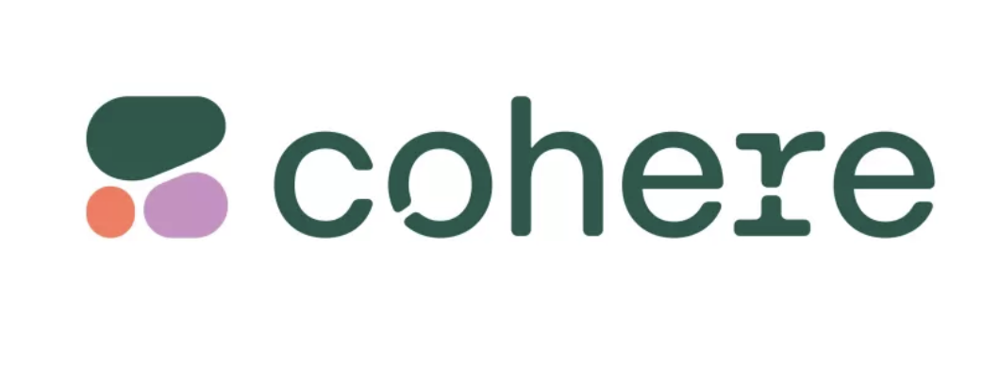
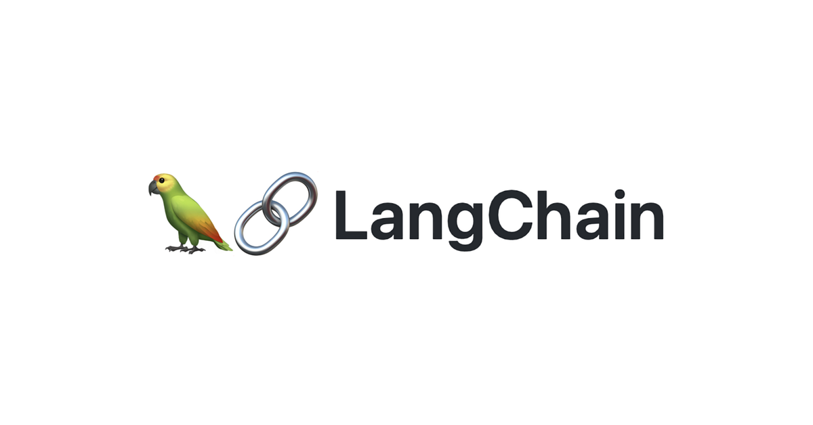

# Sight 👁️

## Computer Vision meets LLMs

 

  
  

## Overview
Imagine a world where the visually impaired don't just recognize objects but also understand their real-time position and relevance. With Sight, we blend the power of OpenCV, the expressiveness of advanced language models with Cohere, and the speed of Pinecone's vector database. We're not just creating an assistant; we're bridging the visual gap, ensuring those without sight can interact seamlessly with their environment in real time!

## Features

1) Real-time Object Detection: Identify and point out objects in the camera's view instantly.
2) Descriptive Guidance: Leveraging the capabilities of large language models, get descriptive and contextually appropriate guidance.
3) Intuitive Feedback: Through feedback, users can understand the environment better and navigate safely.
4) Scalable and Efficient: With Pinecone's vector database, ensure smooth and efficient data retrieval for a better user experience.

## Applications

Most important: Assist visually impaired people in daily activities and help them commute and avoid objects for safety.

1) Daily Commute: Aid users as they walk on the streets, pointing out obstacles, signages, or even familiar faces.
2) Shopping Assistance: Recognize products, read labels, and navigate through aisles in a store.
3) Home Navigation: Identify household items, read out recipes or instructions, and ensure a safe environment at home.
4) Social Interactions: Recognize and name familiar faces in a gathering or event.
4) Reading Support: Aid in reading out loud from books, magazines, or other printed materials.